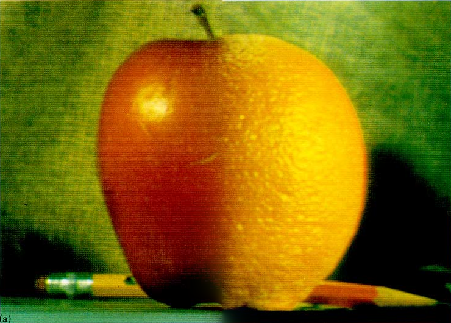
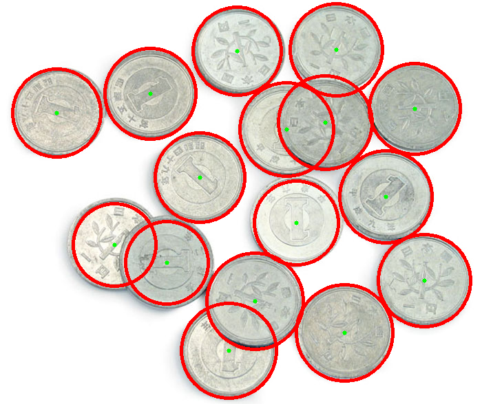

# Computer Vision Homework

Ajou University · Fall 2025  
Instructor: Shin Hyeonjun
Student: Kim Minchae

This repository contains assignments for the **Computer Vision** course, implemented using **C++** and **OpenCV**.

---

## 📁 Assignment List

| No. | Title                         | Description                        |
|-----|-------------------------------|------------------------------------|
| HW1 | Multiband Blending            | Image blending using Laplacian and Gaussian pyramids |
| HW2 | Hough Circle Detection        | Detecting and Counting Coins in image |
| HW3 | Object Tracking               | Real-time tracking of moving objects using OpenCV |
| HW4 | Stereo Vision & Depth Estimation | Computing disparity maps from stereo images |

---

## ✅ HW1: Multiband Blending

**Goal:**  
Blend two images (apple and orange) seamlessly using **multi-resolution pyramids** (Laplacian & Gaussian), based on the method proposed by Burt and Adelson.

**Techniques used:**
- Laplacian pyramid decomposition of input images
- Gaussian pyramid decomposition of masks
- Element-wise blending at each pyramid level
- Reconstructing the final blended image

**Steps:**

1. Read input images:
   - `burt_apple.png`
   - `burt_orange.png`
   - `burt_mask.png`

2. Convert all images to `CV_32F` and normalize to [0, 1] range

3. Create `mask_orange` as: mask_orange = Scalar(1,1,1) - mask_apple

4. Construct pyramids:
- Laplacian pyramids for apple and orange
- Gaussian pyramids for mask_apple and mask_orange

5. At each level `i`, blend as: blended[i] = L_apple[i] * G_apple[i] + L_orange[i] * G_orange[i]

6. Reconstruct final image from the blended Laplacian pyramid

7. Save the result as `output_blend.png`

**Result Preview:**

<p align="center">

</p>

> Result shows smooth transition between apple and orange using mask-based multiband blending

---

## ✅ HW2: Hough Circle Detection

**Goal:**
Detect coins in an image using the Hough Circle Transform, and draw circles around them to visualize detection results.

**Techniques used:**
- Grayscale conversion and preprocessing (blurring)
- nny edge detection (internally used by HoughCircles)
- Circular Hough Transform for detecting circles
- Drawing detected circle centers and boundaries
- Counting total number of detected coins

**Steps:**
1. Load the input coin image (Example: coins0.jpg)
2. Convert the image to grayscale using cvtColor
3. Apply Gaussian blur or median blur to reduce noise:
- GaussianBlur(gray, gray, Size(9, 9), 2, 2);
- Call HoughCircles() with tuned parameters:
- ```
  HoughCircles(gray, circles, HOUGH_GRADIENT,
             1,         // dp: inverse ratio of resolution
             30,        // minDist between centers
             100, 140,  // param1 (Canny upper), param2 (center threshold)
             20, 40);   // min/max radius of coins
  ```
5. Iterate through the detected circles and draw:
- Green dot at center
- Red circle for coin boundary
6. Count total number of detected coins using circles.size()
7. Display or save the annotated result

**Result Preview:**
<p align="center">

</p>

The result highlights each coin with a red circle and marks the center with a green dot.

**Example Output (Console)**
Detected coin count: 8

## 🔧 Requirements

- C++17 or later
- OpenCV 4.x
- Xcode (on macOS) or CMake (for CLI build)

---

## 🚀 Build Instructions (CMake alternative)

If you want to build using CMake (optional):

```bash
cd HW1_Multiband_Blending
mkdir build && cd build
cmake ..
make
./hw1
